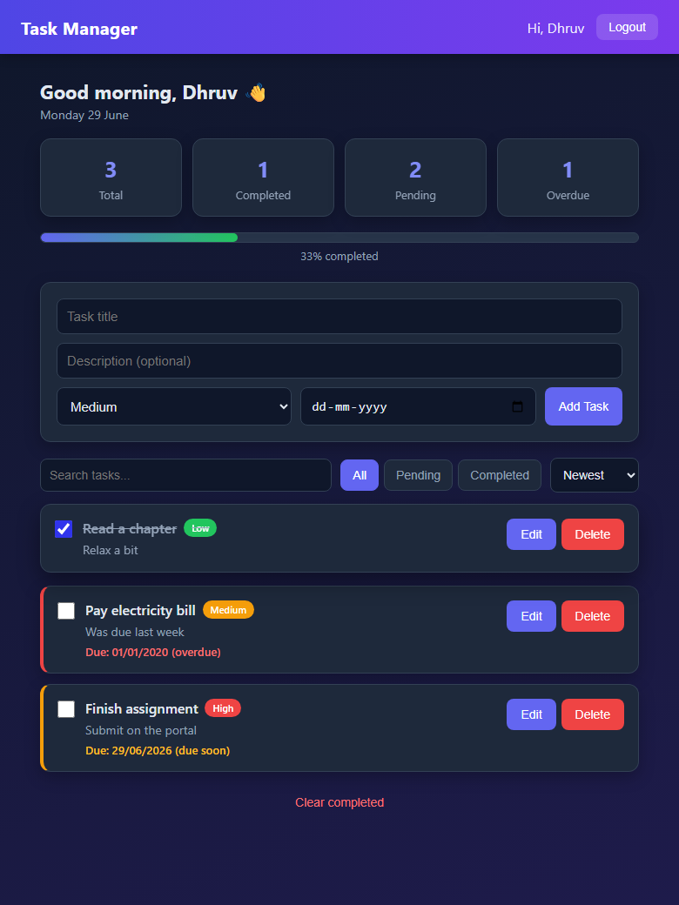

# Task Manager (MERN App)

A task manager web app where you can sign up, log in, and manage your own tasks.
You can add tasks, edit them, mark them as done, and delete them. You can also
search, filter, and sort your tasks. Each user only sees their own tasks.

This is my Major Project for the InternsElite Full Stack Web Development & MERN
Stack training program.

## Screenshot



## Features

- Sign up and log in (with JWT)
- Add, edit, and delete tasks
- Mark tasks as completed
- Set a priority and a due date
- Search, filter, and sort tasks
- See task stats (total, completed, pending, overdue)

## Tech Stack

- React (Vite) – frontend
- Node.js and Express – backend
- MongoDB with Mongoose – database
- JWT – login/authentication

## How to Run

You need Node.js installed and a MongoDB connection string (from MongoDB Atlas).

### 1. Backend

```
cd server
npm install
```

Create a file named `.env` inside the `server` folder:

```
PORT=5000
MONGO_URI=your_mongodb_connection_string
JWT_SECRET=any_secret_text
```

Start it:

```
npm run dev
```

### 2. Frontend

```
cd client
npm install
```

Create a file named `.env` inside the `client` folder:

```
VITE_API_URL=http://localhost:5000/api
```

Start it:

```
npm run dev
```

The app runs at `http://localhost:5173`.

## API Routes

Base URL: `/api`

Auth:

- `POST /auth/register` – create an account
- `POST /auth/login` – log in

Tasks (need a login token):

- `GET /tasks` – get all tasks
- `POST /tasks` – add a task
- `GET /tasks/:id` – get one task
- `PUT /tasks/:id` – update a task
- `PATCH /tasks/:id/toggle` – mark a task done / not done
- `DELETE /tasks/:id` – delete a task
- `DELETE /tasks/completed` – delete all completed tasks

## Live Links

- App: https://mern-task-manager-khaki.vercel.app
- API: https://task-manager-api-v663.onrender.com
